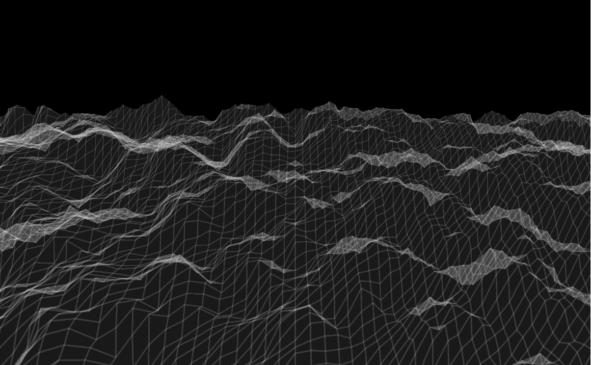

# 3D-Terrain
<p align="center"></p>

Here we are projecting a 3d terrain taht seems like we are going towards it in an endless loop.

here we will be using the concept of **begingShape()** and **endShape()**; in that we will use the **TRIANGLE_STRIP**:
```bash
beginShape(TRIANGLE_STRIP);
		for(let x = 0; x < cols; x++){
			vertex(x*scl, y*scl, terrain[x][y]);
			vertex(x*scl, (y+1)*scl, terrain[x][y+1]);
		}
		endShape();
 ```
 this goes on in a for loop ...
 
 We will create a 2D layer and will be pinching out some vertices into these TRIANGLE_SHAPE.. so that they become some terrains..
 These pinching out will be in random .. to make it less randome we will be using **noise()**... this is very imp and has many applications in many other.
 
 The **noise()** will will decrease the certain part called randomness and fill it with mere similarities..
i.e if you take random values.. they may be like 2, 5, 7, 8, 3, 2,.... but noise values will be .. 1, 3, 2.5, 3.2, 3.5, 2.9.. 

So when we take this noise function and map it to the 2D terrain layer that is about to be the 3D terrain then the result is like ... not random
We will give trthem some **Xoff** and **Yoff** .. so as to determine the movement in those directions in the new 3D layer...

Do this to rotate the 2D vertical layer into a 3D flat surface..
```bash
rotateX(PI/3);
```

Look through the code and try it for yourself...
